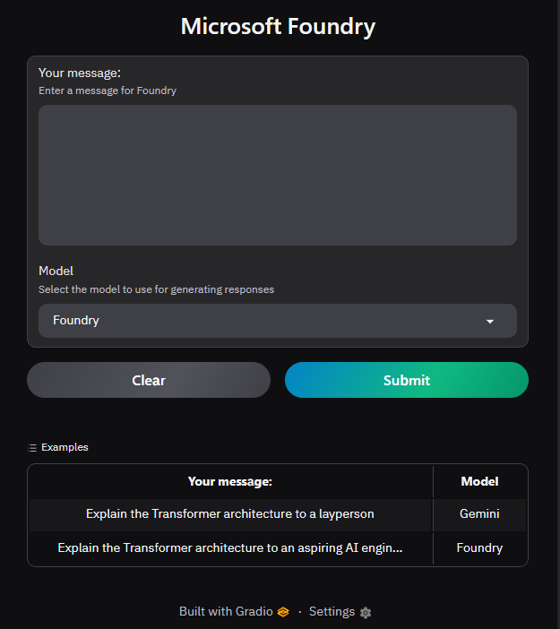

<a id="readme-top"></a>

<!-- PROJECT SHIELDS -->
[![Python][python-shield]][python-url]
[![Gradio][gradio-shield]][gradio-url]
[![OpenAI][openai-shield]][openai-url]

<!-- PROJECT LOGO -->
<br />
<div align="center">
  <h3 align="center">LLM Gradio</h3>

  <p align="center">
    A Gradio-powered chat interface that lets you stream responses from multiple LLM providers — Microsoft Azure Foundry and Google Gemini — side by side.
    <br />
    <br />
    <a href="#getting-started">Get Started</a>
    &middot;
    <a href="#usage">Usage</a>
    &middot;
    <a href="#roadmap">Roadmap</a>
  </p>
</div>

<!-- TABLE OF CONTENTS -->
<details>
  <summary>Table of Contents</summary>
  <ol>
    <li><a href="#about-the-project">About The Project</a>
      <ul>
        <li><a href="#built-with">Built With</a></li>
      </ul>
    </li>
    <li><a href="#getting-started">Getting Started</a>
      <ul>
        <li><a href="#prerequisites">Prerequisites</a></li>
        <li><a href="#installation">Installation</a></li>
      </ul>
    </li>
    <li><a href="#usage">Usage</a></li>
    <li><a href="#roadmap">Roadmap</a></li>
    <li><a href="#license">License</a></li>
    <li><a href="#acknowledgments">Acknowledgments</a></li>
  </ol>
</details>

---

## About The Project

<div align="center">
  
</div>

<br />

LLM Gradio is a lightweight chat web app built with Gradio. It connects to multiple LLM providers via the OpenAI-compatible API and streams responses directly to the UI with markdown rendering.

**Features:**
- 🔀 Switch between **Microsoft Azure Foundry** and **Google Gemini** from a dropdown
- ⚡ **Streaming** responses — text appears token by token
- 📝 **Markdown rendering** of model output
- 🔐 API keys and endpoints managed via `.env`

<p align="right">(<a href="#readme-top">back to top</a>)</p>

### Built With

* [![Python][python-shield]][python-url]
* [![Gradio][gradio-shield]][gradio-url]
* [![OpenAI][openai-shield]][openai-url]

<p align="right">(<a href="#readme-top">back to top</a>)</p>

---

## Getting Started

### Prerequisites

- Python 3.12+
- [uv](https://github.com/astral-sh/uv) (recommended) or pip
- API keys for [Microsoft Azure Foundry](https://ai.azure.com/) and/or [Google AI Studio](https://aistudio.google.com/)

### Installation

1. Clone the repo
   ```sh
   git clone https://github.com/your_username/llm_gradio.git
   cd llm_gradio
   ```

2. Install dependencies
   ```sh
   uv sync
   # or
   pip install -e .
   ```

3. Copy and fill in your environment variables
   ```sh
   cp .env.example .env
   ```
   ```env
   GOOGLE_API_KEY=your_google_api_key
   GOOGLE_BASE_URL=https://generativelanguage.googleapis.com/v1beta/openai/

   FOUNDRY_API_KEY=your_foundry_api_key
   FOUNDRY_BASE_URL=https://<your-resource>.cognitiveservices.azure.com/openai/v1/
   ```

4. Run the app
   ```sh
   uv run main.py
   # or
   python main.py
   ```

<p align="right">(<a href="#readme-top">back to top</a>)</p>

---

## Usage

1. Open the browser tab that launches automatically (or navigate to `http://localhost:7860`)
2. Type a prompt in the **Your message** box
3. Select a model from the **Model** dropdown (`Foundry` or `Gemini`)
4. Click **Submit** and watch the response stream in real time

<p align="right">(<a href="#readme-top">back to top</a>)</p>

---

## Roadmap

- [x] Streaming responses
- [x] Markdown output rendering
- [x] Multi-model support (Foundry + Gemini)
- [ ] Chat history / multi-turn conversations
- [ ] Add OpenRouter as a provider
- [ ] Model parameter controls (temperature, max tokens)

<p align="right">(<a href="#readme-top">back to top</a>)</p>

---

## License

Distributed under the MIT License.

<p align="right">(<a href="#readme-top">back to top</a>)</p>

---

## Acknowledgments

* [Gradio](https://www.gradio.app/)
* [OpenAI Python SDK](https://github.com/openai/openai-python)
* [Microsoft Azure AI Foundry](https://ai.azure.com/)
* [Google AI Studio](https://aistudio.google.com/)
* [Best-README-Template](https://github.com/othneildrew/Best-README-Template)

<p align="right">(<a href="#readme-top">back to top</a>)</p>

<!-- MARKDOWN LINKS & IMAGES -->
[python-shield]: https://img.shields.io/badge/Python-3.12+-3776AB?style=for-the-badge&logo=python&logoColor=white
[python-url]: https://www.python.org/
[gradio-shield]: https://img.shields.io/badge/Gradio-FF7C00?style=for-the-badge&logo=gradio&logoColor=white
[gradio-url]: https://www.gradio.app/
[openai-shield]: https://img.shields.io/badge/OpenAI_SDK-412991?style=for-the-badge&logo=openai&logoColor=white
[openai-url]: https://github.com/openai/openai-python
